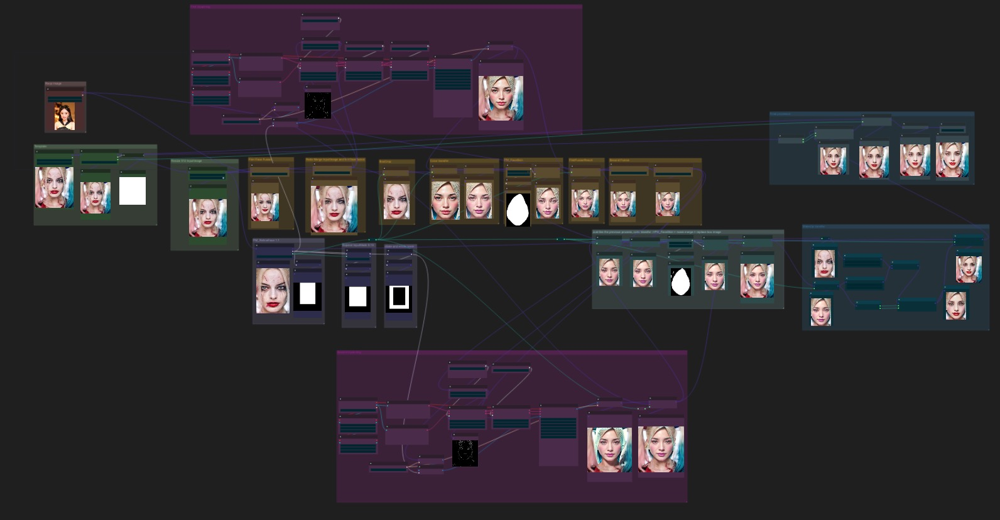

# [Portrait-Maker](https://github.com/THtianhao/ComfyUI-Portrait-Maker)

这个项目改编于[EasyPhoto](https://github.com/aigc-apps/sd-webui-EasyPhoto)，对于[EasyPhoto](https://github.com/aigc-apps/sd-webui-EasyPhoto)进行了流程上的拆解，后续会加入其他项目处理人物头像上的系列操作。



English | [简体中文](./README_zh-CN.md)

## 联系

如果你有任何疑问或建议，可以通过以下方式联系我们：

- 电子邮件：tototianhao@gmail.com
- telegram: https://t.me/+JoFE2vqHU4phZjg1
- QQ 群：10419777
- 微信群： 

## V1.2.0 Update
1. 增加PM_SuperColorTransfer 节点，简化了颜色迁移的流程
2. 增加PM_SuperMakeUpTransfer 节点，简化了进行装扮迁移的流程
3. 增加v1.2.0 workflow 

## v1.1.0 更新
1. faceskin 增加模糊选项
2. 增加 PM_FaceShapMatch节点 与easyphoto的FaceshapMatch一致
3. 增加 PM_MakeUpTransfer节点 与easyphoto的MakeupTransfer一致
4. PM_PortraitEnhancement节点增加一种超分模型，此超分模型可以对人脸不做高光
5. 增加v1.1.0 workflow
6. RetinaFace 支持选择人脸

## v1.0.0 更新

1. 增加模型下载的log
2. 节点重命名解决与其他插件冲突问题
3. Facefusion PM 节点增加 roop 模型
4. 更新workflow
5. 加速第二次的模型加载

## 正在解决
1. 联系 modelscope 解决windows依赖问题


## 安装

**注意：初次启动插件的时候会下载EasyPhoto所需要的所有模型，在terminal中可以看到下载进度，请不要中断下载，(为了启动速度，没有做hash校验)，如果中断下载，需要手动删除上次下载一半的文件，重新下载。**

### windows用户

如果在使用ComfyUI的时候使用zip包解压后的项目，是无法使用本插件的，本项目依赖modelscope，但是ComfyUI官方zip包中的虚拟环境无法安装modelscope，并且ComfyUI作者已经回复了表示无法解决此问题[aliyunsdkcor error](https://github.com/ltdrdata/ComfyUI-Impact-Pack/issues/223)如果windows用户想使用本插件来分析、组合ComfyUI的流程，请自己创建虚拟环境。(我使用的是python3.10.6)，当然如果您知道解决的方法，欢迎提交pr

### 步骤
1. 首先安装ComfyUI

2. ComfyUI运行成功后进入`custom_nodes` 目录 `ComfyUI/custom_nodes/`

```
cd custom_nodes
```

3. 克隆此项目到custom_nodes目录中

```
git clone https://github.com/THtianhao/ComfyUI-Portrait-Maker.git
```

4. 重新启动ComfyUI

## ComfyUI 工作流

Easyphoto工作位置: [./workflow/easyphoto.json](./workflows/easyphoto.json )

在comfyUI的右侧面板中点击Load，选择项目中的./workflow/easyphoto_workflow.json 文件


## 节点介绍

* RetainFace PM:使用Model Scope中的模型进行抠图 [链接](https://www.modelscope.cn/models/damo/cv_resnet50_face-detection_retinaface/summary)
	* image：输入图像
	* multi_user_facecrop_ratio：提取头像区域的倍数
    * face_index : 选择第几个人脸
* FaceFusion PM:将两张图像的人脸进行融合
	* image：输入图像
	* user_image：要融合的头像
    * model: 使用ali的模型还是roop模型进行融合
      * ali：[链接](https://www.modelscope.cn/models/damo/cv_unet-image-face-fusion_damo/summary)
      * roop: [链接](https://github.com/deepinsight/insightface)
* RatioMerge2Image PM: 按照比例融合两张图片
	* image1：输入的图像
	* Image2：输入的图像
	* fusion_rate： 融合比例，最大为1，越大越偏向image1
* MaskMerge2Image PM: 利用Mask将图片进行融合
	* image1：输入的图像
	* image2：输入的图像
	* mask：需要替换的mask
* ReplaceBoxImg PM: 替换box区域中的图片
	* origin_image： 原始图像
	* box_area：区域
	* replace_image：区域中要替换的图像(box_area和replace_image的分辨率要保持一致)
* ExpandMaskFaceWidth PM: 对Mask的宽度进行比例扩张
	* mask：输入的Mask
	* box：mask对应的box
	* expand_width：宽度扩张的比例，根据box的宽度扩张
* BoxCropImage PM:利用box对图片进行裁剪
* ColorTransfer PM:对图片进行颜色迁移
* FaceSkin PM:提取图片中人脸的部分的Mask
* MaskDilateErode PM: 对Mask进行膨胀与腐蚀
* SkinRetouching PM:使用以下模型进行皮肤美化
  * [链接](https://www.modelscope.cn/models/damo/cv_unet_skin-retouching/summary)
* PortraitEnhancement PM:使用以下模型处理图像
  * model
    * gpen : [链接](https://www.modelscope.cn/models/damo/cv_gpen_image-portrait-enhancement/summary)
    * real_gan:[链接](https://www.modelscope.cn/models/bubbliiiing/cv_rrdb_image-super-resolution_x2/summary)
* ImageResizeTarget PM:将图片缩放到目标宽高
* ImageScaleShort PM: 将图片的宽高中小的部分缩减到
	* image：输入图像
	* size：要缩放的长度（按照宽高中最短的一边进行比例缩放）
	* crop_face：缩放后宽高要以32为倍数
* GetImageInfo PM: 提取图片的宽高
* FaceShapMatchPM: 扩散后的图片和原图片进行一定的融合，减少脸旁边的差异
* MakeUpTransferPM: 使用gan网络模型对妆容进行一定的迁移
* SuperMakeUpTransferPM:(多节点的整合)融合两张图片的装扮
* SuperColorTransferPM：(多节点的整合)迁移两张图片的颜色

## 贡献

如果你发现任何问题或有改进建议，欢迎贡献。请遵循以下步骤：

1. 分支出一个新的特性分支：`git checkout -b feature/your-feature-name`
2. 进行修改并提交：`git commit -m "Add new feature"`
3. 推送到你的远程分支：`git push origin feature/your-feature-name`
4. 创建一个 Pull 请求（PR）。

## 许可证

该项目采用 MIT 许可证。查看 [LICENSE](LICENSE) 文件以获取详细信息。


欢迎加入我们，为 EasyPhoto ConfyUI Plugin 的发展做出贡献！
